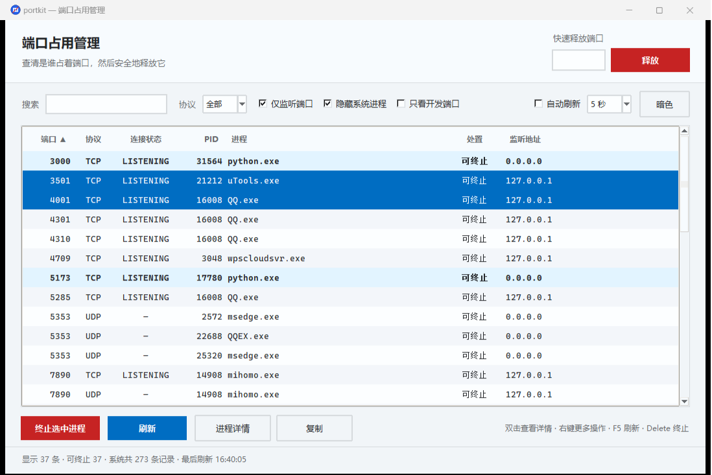
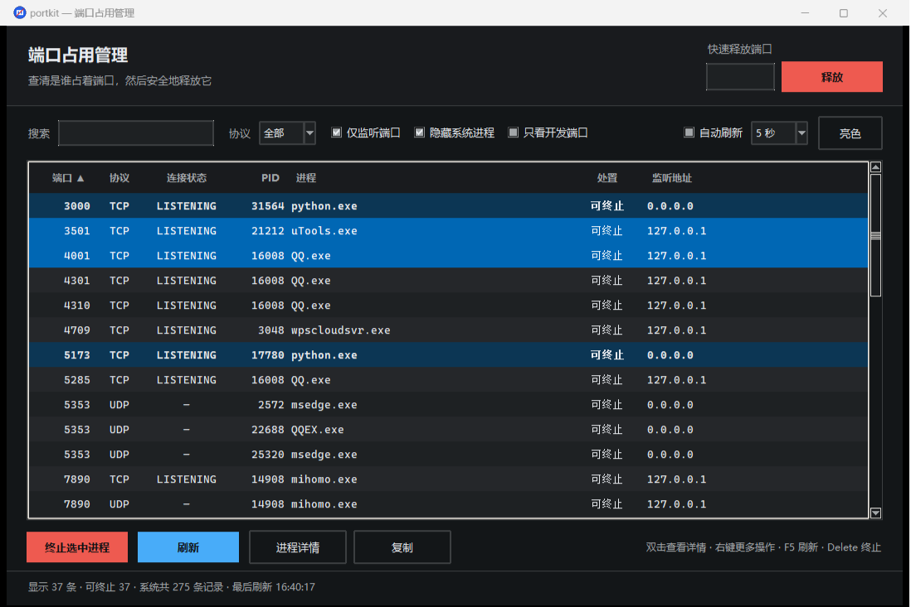

# portkit — 端口占用检查与释放工具

> 专治 `Address already in use` / `端口已被占用`：一眼看清是谁占着端口，一键把它释放掉。



<details>
<summary>暗色主题（界面内一键切换）</summary>


</details>

<p align="center">
  <a href="https://github.com/gzytop/portkit/actions/workflows/ci.yml"></a>
  
  
  
  
</p>

---

## 这个工具解决什么问题

启动项目时看到这种报错，你大概会开始一套熟悉的手工操作：

```
Error: listen EADDRINUSE: address already in use :::3000
```

平时你得敲两条命令、还要手动从一堆输出里找 PID：

```bash
netstat -ano | findstr :3000     # 从输出里人眼找 PID
taskkill /F /PID 12345           # 复制粘贴 PID 再杀
```

用 portkit，一步搞定：

```bash
port kill 3000
```

或者打开图形界面，在输入框敲 `3000` 回车。

## 特性

- **零第三方依赖** — 只用 Python 标准库 + 系统自带命令，`git clone` 完就能跑，不用 `pip install`
- **图形界面 + 命令行** — 两者共用同一套核心逻辑，行为完全一致
- **可打包成 exe** — 单文件 11 MB，拷到别的电脑双击即用，目标机器不需要装 Python
- **误杀防护** — `System`、`lsass.exe`、`svchost.exe` 等系统关键进程默认拒绝终止
- **先温和后强硬** — 先请求进程正常退出，2 秒内没退再强杀，避免数据丢失
- **杀完会复查** — 轮询确认端口真的空出来了才报「成功」，不给假结论
- **区分真占用和残留** — `TIME_WAIT` 这类无主连接会明确标注「等一会自动释放」，而不是让你去杀一个杀不掉的东西

## 快速开始

### 方式一：下载 exe（最简单，不需要 Python）

前往 [Releases](../../releases) 下载 `PortKit.exe`，双击即可运行。

建议把它放在固定位置，然后右键「固定到任务栏」，以后端口被占用一键打开。

### 方式二：从源码运行

```bash
git clone https://github.com/gzytop/portkit.git
cd portkit

# 图形界面
python portkit_gui.py

# 命令行
python portkit.py check 3000
```

需要 Python 3.9+。**不需要安装任何依赖包。**

<details>
<summary>Linux 上如果提示找不到 tkinter</summary>

图形界面需要 tkinter。Windows 和 macOS 的官方 Python 自带，部分 Linux 发行版需要单独装：

```bash
sudo apt install python3-tk      # Debian / Ubuntu
sudo dnf install python3-tkinter # Fedora
```

命令行部分不需要 tkinter，装不上也能正常用。
</details>

---

## 图形界面使用教程

启动方式：

```bash
python portkit_gui.py
```

Windows 下也可以双击 `port-gui.bat`（不会弹出黑色控制台窗口）。

### 最常用的操作：释放一个端口

1. 在右上角**「快速释放端口」**输入框敲入端口号，比如 `3000`
2. 按回车，或点红色的**「释放」**按钮
3. 弹窗会列出即将终止的进程，确认后点「是」
4. 结束后会告诉你是否成功、端口是否真的释放了

### 界面各部分说明

| 区域 | 作用 |
|---|---|
| **快速释放端口**（右上） | 输入端口号直接释放，最快的救火路径 |
| **搜索框** | 按端口号、PID、进程名、监听地址实时过滤。想找 node 就输 `node` |
| **协议** | 只看 TCP 或 UDP |
| **仅监听端口** | 默认勾选。取消后会显示 `ESTABLISHED` 等所有连接 |
| **隐藏系统进程** | 默认勾选，把 `svchost.exe`、`System` 等噪音收起来（它们通常占了列表的一大半） |
| **只看开发端口** | 只显示 3000 / 5173 / 8080 / 3306 / 6379 等常用开发端口 |
| **自动刷新** | 可选 2 / 5 / 10 / 30 秒。适合「等某个端口释放」的场景，盯着它自己变 |
| **亮色 / 暗色** | 右侧按钮一键切换主题，按钮文案指向切换后的结果 |
| **状态栏**（底部） | 显示「可终止」「系统保护」「内核残留」各有多少条，一眼知道哪些是真能处理的 |

### 表格操作

- **点列头排序** — 点「端口」「PID」「进程」等表头切换升序/降序
- **多选批量终止** — 按住 `Ctrl` 或 `Shift` 选多行，一次性全部终止
- **双击某行** — 查看该进程的**完整命令行**，用来判断「这个 node 到底是我哪个项目」
- **右键菜单** — 终止选中进程 / 强制终止（跳过系统保护）/ 查看详情 / 复制这一行

### 怎么读这张表

「处置」列直接用文字说明这一行能不能动，颜色只是辅助 —— 色觉障碍用户同样能分辨：

| 处置 | 行的样式 | 含义 |
|---|---|---|
| 可终止 | 常规 / 淡蓝底加粗 | 普通进程，可以放心终止。**淡蓝底加粗的是常用开发端口**，不用筛选就能一眼扫到 |
| 系统保护 | 琥珀色 | 系统关键进程，**默认拒绝终止**。确实要杀得用右键「强制终止」 |
| 内核残留 | 灰色 | `TIME_WAIT` 等待关闭的连接，没有进程可杀，等几十秒自动消失 |

### 快捷键

| 按键 | 功能 |
|---|---|
| `F5` 或 `Ctrl+R` | 刷新 |
| `Delete` | 终止选中的进程 |

---

## 命令行使用教程

```bash
python portkit.py <子命令> [参数]
```

Windows 下可以用 `port.bat`，命令更短（把项目目录加入 `PATH` 后，任意目录都能用）：

```bat
port check 3000
```

### `check` — 查端口被谁占了

```bash
python portkit.py check 3000
python portkit.py check 3000 5173 8080      # 一次查多个
```

三种结果：

```
空闲  端口 3000 未被占用
占用  端口 5173 被 node.exe(PID 18412) 占用
残留  端口 8080 只有 TIME_WAIT 等待关闭的连接，无进程占用，通常几十秒后自动释放
```

**退出码**：被进程占用返回 `1`，否则返回 `0`。所以可以这样写启动脚本：

```bash
# 端口被占就先释放，然后启动服务
python portkit.py check 3000 || python portkit.py kill 3000 -y
npm run dev
```

### `kill` / `free` — 释放端口

```bash
python portkit.py kill 3000            # 会逐个询问确认
python portkit.py kill 3000 8080 -y    # -y 跳过确认，批量释放
python portkit.py kill 3000 -t         # 连带终止子进程（如 npm 启动的一串 node）
python portkit.py kill 3000 -f         # 强杀，并解除系统进程保护（慎用）
```

| 参数 | 作用 |
|---|---|
| `-y` / `--yes` | 跳过确认，适合写进脚本 |
| `-t` / `--tree` | 连带终止子进程（Windows 用 `taskkill /T`） |
| `-f` / `--force` | 直接强杀，且允许终止系统关键进程 |

### `ls` — 列出端口占用

```bash
python portkit.py ls                     # 所有监听中的端口
python portkit.py ls --protocol tcp      # 只看 TCP
python portkit.py ls --port 3000 8080    # 只看指定端口
python portkit.py ls --name node         # 按进程名关键字过滤
python portkit.py ls -a                  # 包含 ESTABLISHED 等非监听连接
python portkit.py ls --json              # JSON 输出，方便管道给别的工具
```

### `dev` — 常用开发端口体检

一次扫描 3000 / 5173 / 8080 / 3306 / 5432 / 6379 / 11434 等 25 个常用端口，直接告诉你哪些能用：

```bash
python portkit.py dev
python portkit.py dev --port 3000 3001 8000   # 自定义端口集合
```

### 交互模式

不带任何参数运行，进入列表 + 选序号的交互模式：

```bash
python portkit.py
```

```
当前监听端口（已隐藏系统进程）
#   端口   协议  状态       PID    进程       监听地址
--  -----  ----  ---------  -----  ---------  ---------
1   3000   TCP   LISTENING  22596  node.exe   0.0.0.0
2   5173   TCP   LISTENING  18412  node.exe   127.0.0.1

输入序号终止对应进程；:<端口号> 按端口终止；a=切换系统进程显示；r=刷新；q=退出
portkit>
```

| 输入 | 作用 |
|---|---|
| `1` | 终止第 1 行占用的端口 |
| `:3000` | 按端口号释放 |
| `a` | 显示/隐藏系统进程 |
| `r` | 刷新 |
| `q` | 退出 |

---

## 打包成 exe

```bat
build_exe.bat
```

产物是单文件 `dist\PortKit.exe`（约 11 MB），拷到任何 Windows 电脑双击就能用，**目标机器不需要装 Python**。

脚本会自动完成这些事，你不用管：

1. 创建虚拟环境 `.venv\`（只用于打包，不影响你的全局 Python）
2. 安装 PyInstaller
3. 用 `make_icon.py` 生成图标
4. 打包并校验产物

| 项 | 说明 |
|---|---|
| 产物 | `dist\PortKit.exe`，单文件 |
| 体积 | 约 10.9 MB（含 Python 运行时和 tkinter） |
| 首次启动 | 约 1–2 秒（单文件需解压到临时目录），之后更快 |
| 文件属性显示 | 「端口占用管理器」，任务管理器里也是这个名字 |

改完源码想重新打包，再跑一次 `build_exe.bat` 就行。

<details>
<summary>为什么 exe 文件名是英文的？</summary>

早期版本用的是中文文件名 `端口管理器.exe`，结果 `.bat` 构建脚本挂了 —— cmd 用 GBK 解析 UTF-8 脚本，导致 `if exist "dist\端口管理器.exe"` 永远判断为假。中文文件名在 cmd、`PATH` 和一些工具链里确实有编码摩擦。

所以文件名改用 ASCII 的 `PortKit.exe`，而中文名称通过 Windows 版本信息呈现（见 `version_info.txt`）——文件属性和任务管理器里显示的仍是「端口占用管理器」。

你想改成任何名字都可以，直接重命名 exe，不影响功能。
</details>

<details>
<summary>杀毒软件报毒怎么办？</summary>

PyInstaller 打包的程序偶尔会被杀软标记，因为「自解压 + 调用 taskkill」的行为特征和某些恶意软件相似。这是 PyInstaller 的共性问题，不是程序本身有问题。

两个办法：
- 把 `PortKit.exe` 加入杀软白名单
- 或者直接用源码运行 `python portkit_gui.py`，功能完全一样
</details>

---

## 权限说明

终止**其他用户或系统服务**持有的进程需要更高权限：

- **Windows** — 右键 exe 选「以管理员身份运行」，或用管理员身份打开终端。权限不足时会明确提示「拒绝访问，请用管理员身份重新运行」，不会静默失败
- **macOS / Linux** — 用 `sudo python portkit.py kill 80`

日常释放自己启动的开发服务（node、python、java 等）**不需要管理员权限**。

## 安全设计

这个工具会杀进程，所以做了几层防护：

1. **系统关键进程保护名单** — `System`、`lsass.exe`、`svchost.exe`、`services.exe`、`wininit.exe`、`systemd`、`launchd` 等默认直接拒绝并警告，必须显式 `--force`（GUI 里是右键「强制终止」）才会执行。误杀这些进程可能导致系统不稳定甚至蓝屏
2. **PID 0 / 4 视为内核占位** — 不会被当成可终止目标
3. **默认都要确认** — 命令行加 `-y` 才跳过，GUI 会弹窗列出目标进程
4. **优雅退出优先** — 先发 `SIGTERM` / `taskkill`（不带 `/F`），给进程保存数据的机会，2 秒内没退才强杀
5. **终止后复查端口** — 确认真的释放了才报成功

## 工作原理

不同平台调用各自的系统工具，不依赖任何第三方库：

| 平台 | 枚举端口 | 查进程名 | 终止进程 |
|---|---|---|---|
| Windows | `netstat -ano` | `tasklist` | `taskkill` → `taskkill /F` |
| macOS | `lsof -nP -i` | 同上 | `SIGTERM` → `SIGKILL` |
| Linux | `lsof` 或 `ss -tulnpH` | 同上 | `SIGTERM` → `SIGKILL` |

GUI 里所有耗时操作（`netstat`、`taskkill`）都在后台线程执行，结果通过队列回传主线程渲染，所以界面不会卡住。

## 项目结构

```
portkit/
├── portkit.py          # 核心逻辑 + 命令行入口（采集 / 过滤 / 终止都在这）
├── portkit_gui.py      # tkinter 图形界面，直接复用 portkit.py 的函数
├── theme.py            # 设计令牌：OKLCH 色板推导、字号阶梯、间距标尺
├── port.bat            # Windows 命令行快捷入口
├── port-gui.bat        # Windows 图形界面快捷入口（无控制台窗口）
├── build_exe.bat       # 一键打包出 dist\PortKit.exe
├── portkit.spec        # PyInstaller 打包配置
├── make_icon.py        # 生成图标（手写 ICO 字节，不需要 Pillow）
├── version_info.txt    # exe 的 Windows 版本信息
├── .impeccable.md      # 设计上下文与设计原则
├── tests/
│   └── smoke_test.py   # 冒烟测试（标准库 unittest，本地与 CI 共用）
├── .github/
│   ├── workflows/      # CI 与自动发版流水线
│   └── scripts/        # 流水线用到的辅助脚本
└── docs/
    ├── screenshot.png
    └── screenshot-dark.png
```

GUI 是对 `portkit.py` 的一层封装，不重复实现任何逻辑，所以两种用法的行为和安全策略天然一致。

## 设计说明

界面的设计取向记录在 [`.impeccable.md`](.impeccable.md)，核心是三条：

**颜色只编码状态，不做装饰。** 每种着色都对应一个用户需要区分的语义 —— 可终止 / 系统受保护 / 内核残留 / 常用开发端口。看不出含义的颜色一律去掉。

**破坏性操作要有视觉分量。** 按钮按危险程度分三级：终止（实心红）> 刷新（实心蓝）> 详情与复制（描边）。早期版本里「刷新」和「终止」都是实心高饱和色，对一个不可撤销的操作来说过于危险。

**零依赖不是简陋的借口。** tkinter 没有 CSS，但 `theme.py` 自己实现了 OKLCH → sRGB 转换，用「亮度 / 彩度 / 色相」三个可解释维度描述颜色：

- 中性灰统一朝品牌色相偏移极少量彩度（tinted neutrals），整体更协调，又不会明显看出色偏
- 明暗两套主题共用同一份语义定义，只改亮度锚点，不需要两边各写一遍魔法值
- **对比度可以直接算出来并断言**，而不是靠肉眼判断

最后一点落成了测试：`tests/smoke_test.py` 会遍历两套主题上**界面真实出现的每一个前景/背景组合**（包括斑马纹行、系统进程行、开发端口行这些容易被忽略的位置），断言全部达到 WCAG AA 的 4.5:1。想看当前数值：

```bash
python theme.py
```

无障碍方面：状态不只靠颜色区分 —— 表格有独立的「处置」列用文字说明能不能终止，色觉障碍用户同样可用。

## 参与开发

### 跑测试

```bash
python tests/smoke_test.py        # 全部测试
python tests/smoke_test.py -v     # 显示每项名称
```

测试只用标准库 `unittest`，无需安装任何东西。其中端口相关的用例会**真实占用一个系统分配的空闲端口、起一个子进程再终止它**，而不是用 mock —— 因为这个工具的价值就在于跟真实操作系统打交道，mock 掉就等于什么都没测。

没有图形显示的环境（如无头服务器）会自动跳过 GUI 用例。

### 持续集成

每次推送都会在 **Windows / macOS / Ubuntu** 三个平台跑同一份测试，另外用 Python 3.9 兜一遍最低版本兼容性。

跨平台跑不是为了凑数：Windows 走 `netstat`/`taskkill`，POSIX 走 `lsof`/`ss` + 信号，只在一个平台测等于另一条分支从未被验证。CI 建立后立刻抓出了两个只在特定平台出现的真实缺陷：

- **POSIX 上僵尸进程被误判为「仍在运行」** — 进程被杀后会先变成僵尸（已退出但未被父进程回收），而 `os.kill(pid, 0)` 对僵尸依然成功，导致终止操作等到超时并误报失败
- **中文输出在 cp1252 控制台上直接崩溃** — 英文版 Windows 与 CI runner 的默认编码不是 UTF-8，`make_icon.py` 打印中文时抛 `UnicodeEncodeError`，让构建失败在生成图标这步

Ubuntu 的任务**故意不安装 `lsof`**，好让「没有 lsof 时退回 `ss`」这条备选路径真的被执行到。

### 发版

打一个 `v` 开头的 tag 即可，其余自动完成：

```bash
git tag v1.2.0
git push origin v1.2.0
```

流水线会依次：跑测试 → 生成图标 → 打包 exe → 校验产物大小是否合理 → **真实启动 exe 确认能创建窗口** → 计算 SHA256 → 创建 Release 并上传。

最后那一步很关键：PyInstaller 常见的坑是「构建成功但一运行就因缺模块退出」，只检查文件存在是发现不了的。

也可以在 Actions 页面手动触发 Release 流水线，此时只产出构建物、不创建 Release，用于验证打包链路本身。

## License

[MIT](LICENSE)
